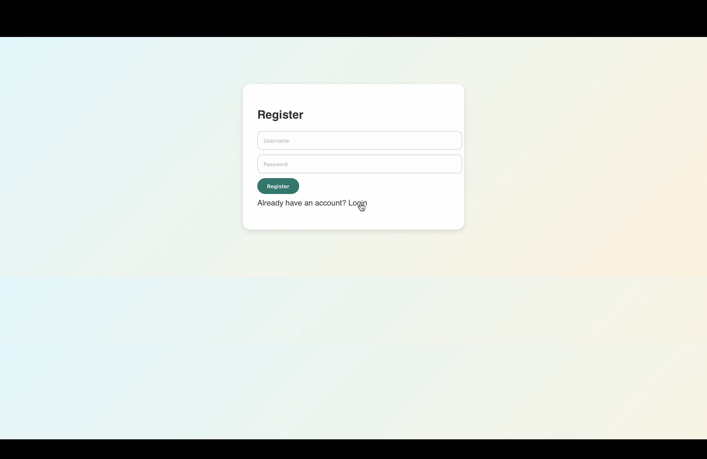
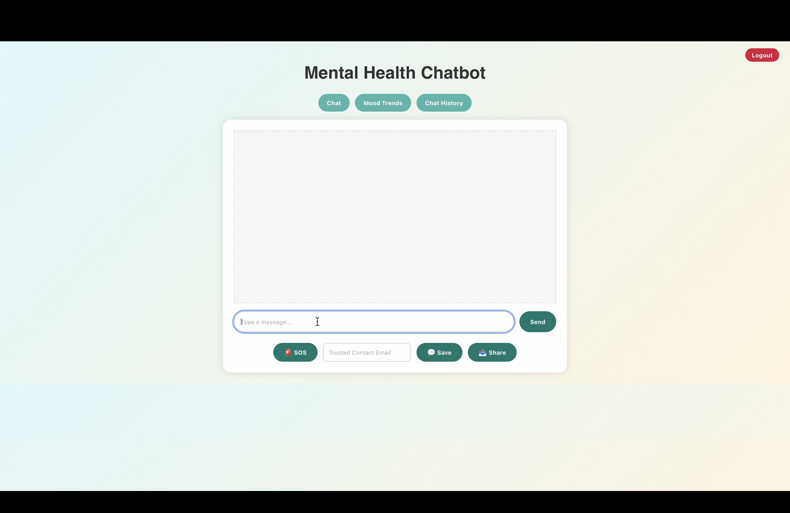
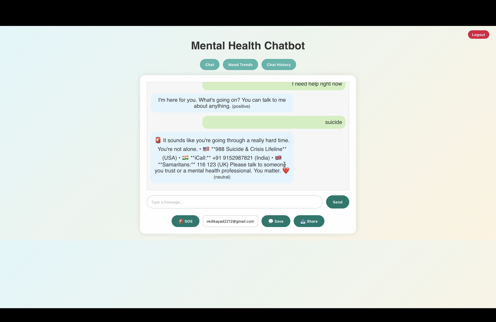
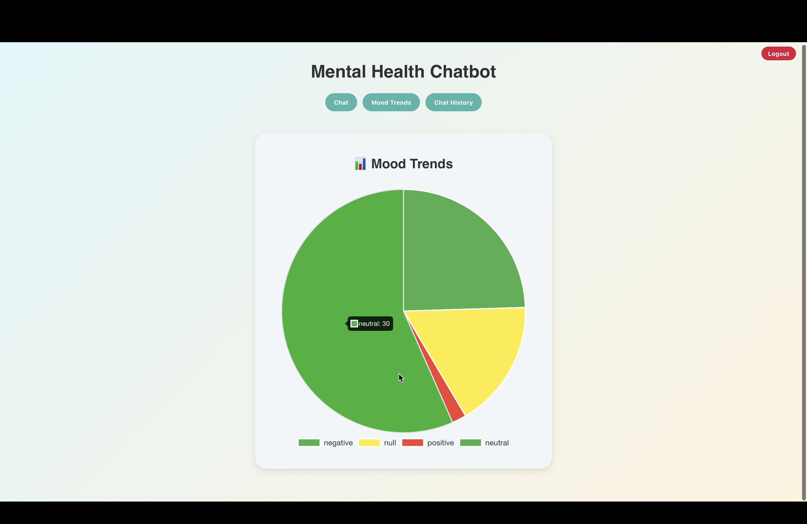

# 🧠 Mental Health Chatbot
### AI-Powered Emotional Support & Crisis Intervention System

> **Detecting distress. Delivering support. Saving lives.**
> A conversational AI system built to address the global mental health crisis — providing immediate, stigma-free, 24/7 emotional support.

---

## 🚨 The Problem We're Solving

| Problem | Impact |
|--------|--------|
| 🧠 Rise in mental health struggles & suicidal thoughts | Millions left without help |
| ⏰ Limited 24/7 emotional support systems | Crisis happens anytime |
| 🔒 Stigma prevents people from asking for help | Silent suffering |
| 🛡️ Need for safe, private, always-available solution | Gap in mental healthcare |

---

## 🎯 Project Objectives

1. **Detect** signs of distress or suicidal intent in real-time conversations
2. **Offer** immediate motivational and emergency support
3. **Guide** users to mental health professionals when needed
4. **Introduce** safety mechanisms to reduce crisis escalation

---

## 📸 Screenshots

### 🔐 User Login

### 💬 Main Interface

### 🚨 Crisis Detection in Action

> When a user expresses distress, the bot instantly provides crisis hotlines across USA 🇺🇸, India 🇮🇳 and UK 🇬🇧

### 📊 Mood Trends Dashboard

> Visual pie chart tracking sentiment across all conversations — negative, neutral, positive

---

## ✨ Key Features

| Feature | Description |
|--------|-------------|
| 🔴 **Emergency SOS Button** | Instantly connects users to emergency services during a crisis |
| 🤝 **Trusted Contact System** | Alerts pre-configured trusted contacts when distress is detected |
| ⏱️ **Conversation Timeout** | Auto-detects inactivity and follows up with safety check-ins |
| 🩺 **Session Sharing With Therapist** | Securely shares conversation history with mental health professionals |
| 📊 **Mood Trends Dashboard** | Visual analytics of emotional patterns over time |
| 🃏 **Emergency Resource Card** | Instantly displays crisis hotlines across multiple countries |

---

## 🛠️ Tech Stack

\`\`\`
Language     →  Python 3.10+
Editor       →  Visual Studio Code
AI Engine    →  OpenAI GPT-based responses
Libraries    →  time, openai (optional)
Platform     →  Console-based (Scalable to Web/App)
\`\`\`

---

## 🚀 Getting Started

### Prerequisites
- Python 3.10+
- OpenAI API Key (optional for GPT responses)

### Installation

\`\`\`bash
# Clone the repository
git clone https://github.com/bhavani2143/mental-health-chatbot.git

# Navigate to project directory
cd mental-health-chatbot

# Install dependencies
pip install -r requirements.txt

# Run the chatbot
python main.py
\`\`\`

---

## 🔮 Future Improvements

- 🌐 Web & Mobile App Interface
- 🤖 Fine-tuned Mental Health AI Model
- 📊 Advanced Mood Tracking & Analytics Dashboard
- 👥 Multi-language Support
- 🔐 HIPAA-compliant Data Security

---

## 💡 Why This Matters

> *"1 in 5 people worldwide experience a mental health condition. Most never get help."*

This project was built with empathy at its core — to bridge the gap between someone in crisis and the help they need, instantly and without judgment.

---

## 👩‍💻 Author

**Bhavani Devi Mulakala**

---

⭐ **If this project helped you or inspired you, please give it a star!**
